This article comes as a solution to avoid bypassing the IPS blade in Check Point Firewall.

If you don't read Bypass IPS in Check Point Firewall, Please go and read it first.

## Reflected XSS

In the previse attack we were able to bypass IPS Blade with strict mode using the following payload 

```jsx
1'">
```

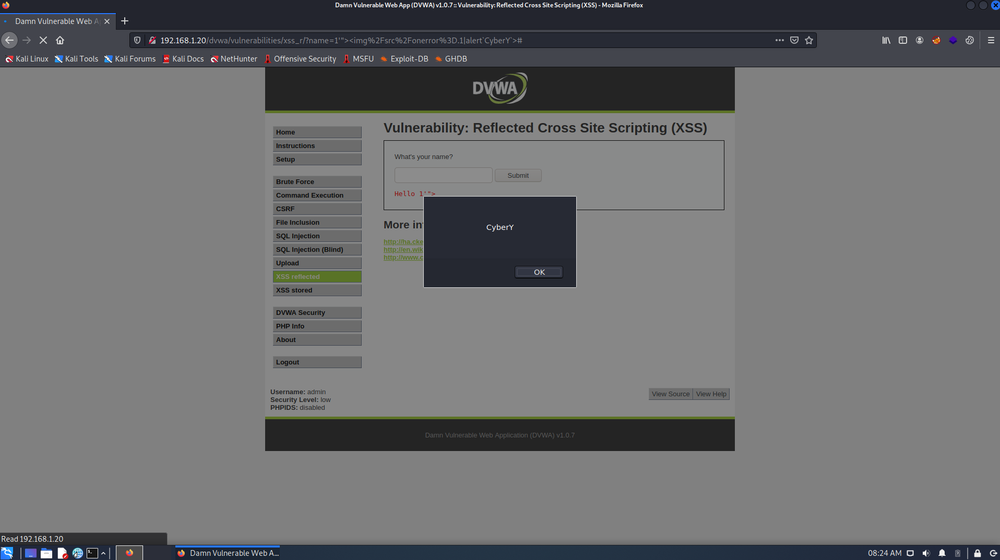

Go to SmartConsole, Click Logs & Monitor you should able to see that the IPS was able to Detect but not prevent.

To prevent this attack from happening follow the stipes below:

1- Click on Logs & Monitor.

2- Click on Cross-Site Script Infront of Protection Name.

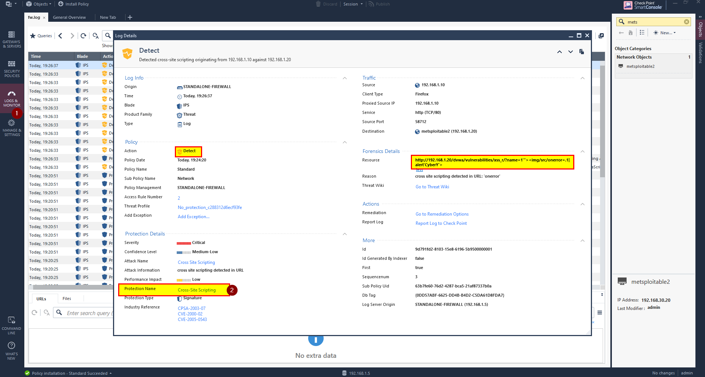

3- Right Click on Strict profile and select Edit.

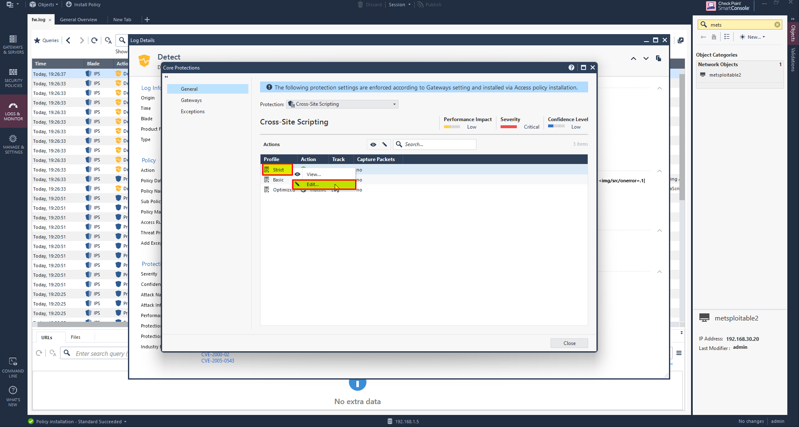

4- Select Override with Action and choose Drop to drop any packet.

5- Click Ok


6- From Menu click on Install database..

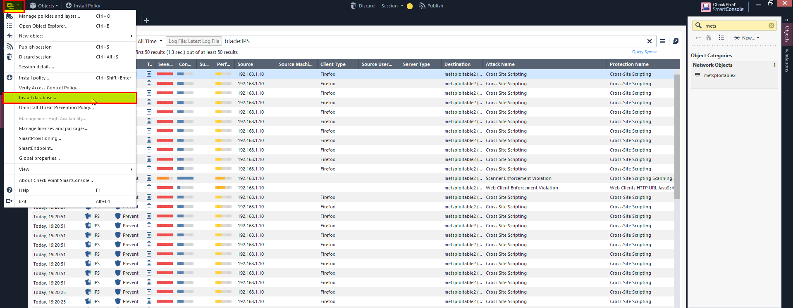

7- Then Click Publish and Install.


8- After install Database Install Polices. 


After successfully install the polices, preform the attack again then go to logs and check the behavior of the IPS blade.

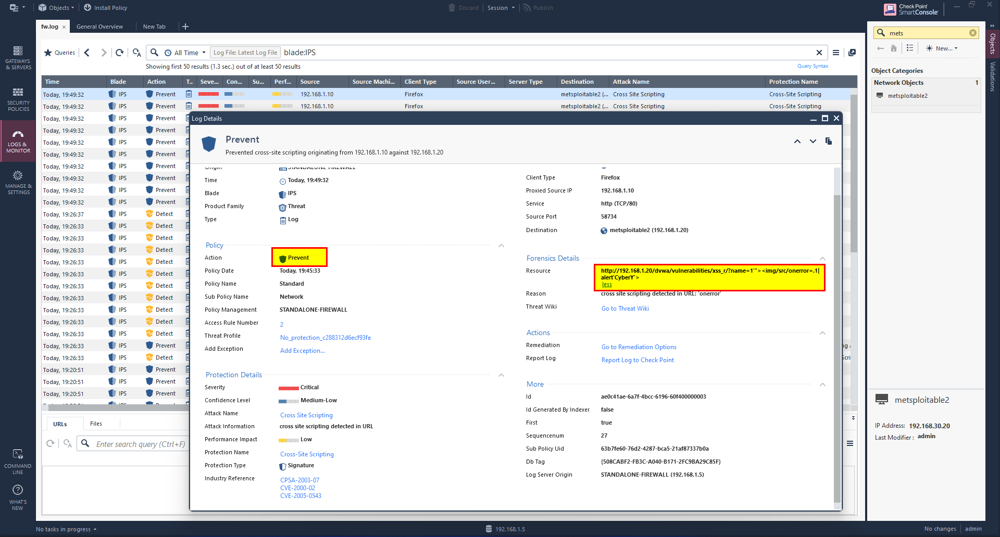

The attack failed as has been prevented using IPS Blade.

In Case if the attack is successfully and the IPS blade not able to detect it.

1- Click Security Policies, and in Threat Prevention Select Policy.

2- Select IPS Protections.

3- Select Core protection.

4- use search bar and search for Cross-Site Scripting

5- Right click on Strict profile and select Edit.

6- Click on Advance, then click on '+' to add your pattern.

After adding pattern click Ok then Install the database and push the policies.


Preform the attack and check wither the IPS prevent the attack or not.

**Attack has been prevented.**

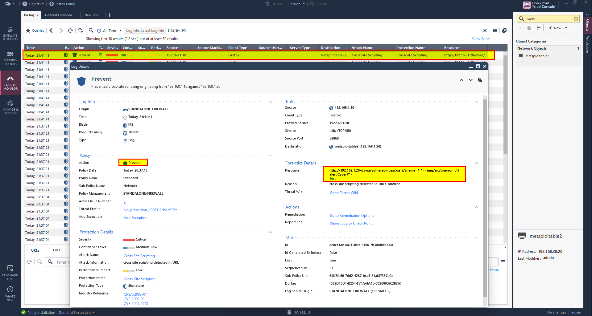

In this rather than detect the attack only we prevent it and drop the packet.

## SQL Injection

In the previse attack we were able to bypass IPS Blade with strict mode using the following payload

```sql
1'/*! */or/*! */'1/*! */--/*! */
```


In this case the IPS blade does not detect or prevent the attack, the packet is passed like legitimate packet.

To prevent this follow steps below:

1- Click on Security Policies in SmartConsole.

2- In Threat Prevention Select Policy.

3- Select IPS Protections.

4- Select Core Protection.

5- In search bar, Search for **sql**.

6- Right click and select Edit.

7- In Strict profile right click and select Edit.

8- Click on Advance.

9- In Non-distinct SQL Commands search for `or` and `||`, if not there use '+' and add them, then click check box.

10- Click Ok.

11- Install the database, then push the policies.

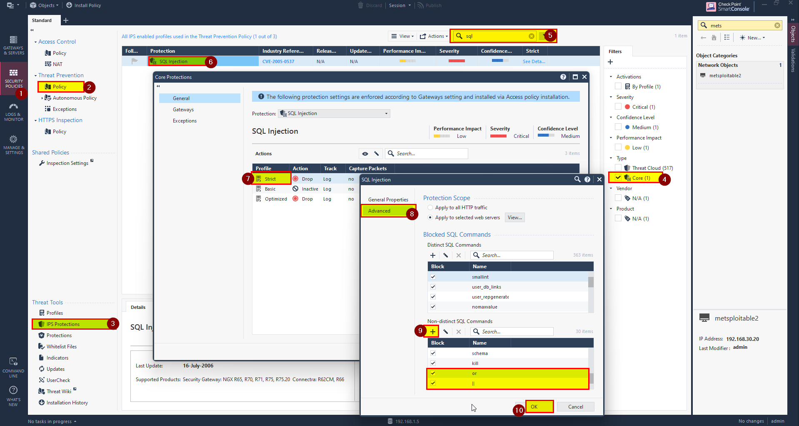


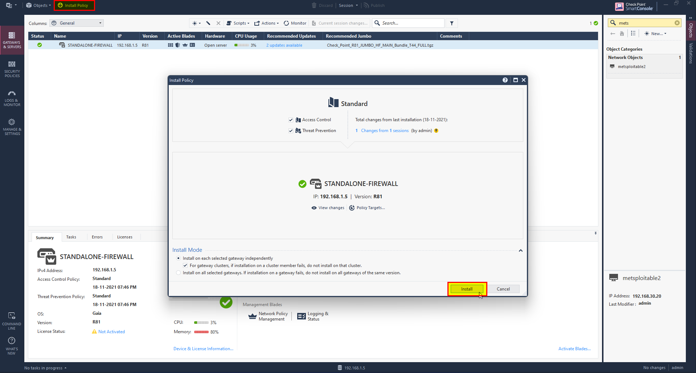

Preform the attack and check wither the IPS prevent the attack or not.

**Attack has been prevented.**

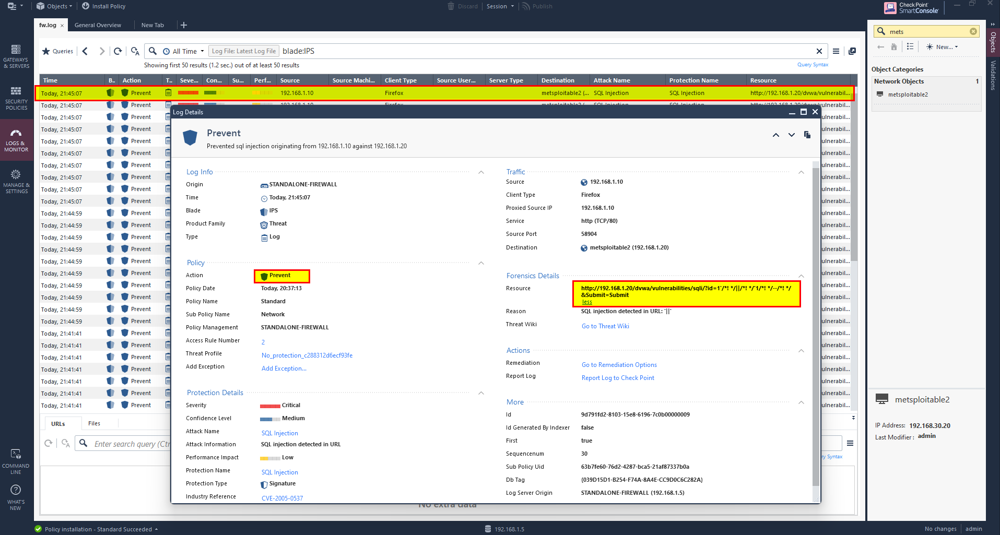

## File Upload

In the previse attack we were able to bypass IPS Blade with strict mode using the following payload header.

```php
GIF89a;
   <?
   system($_GET['cmd']); # shellcode goes here
   ?>
```

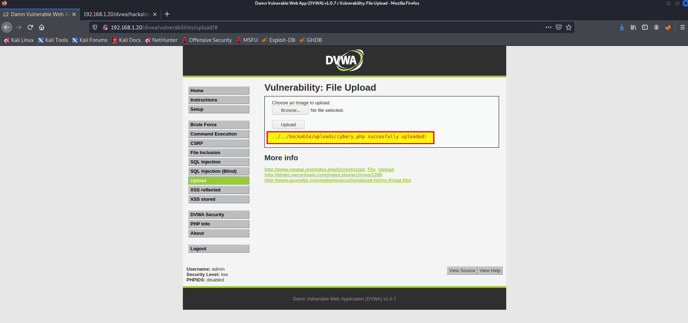

When I tried to upload a legitimate file it prevents and flag it as XSS.


Each image contains a header like ����JFIF��� this may contain special symbols such as quotes ('') which flag as XSS.

To solve this issue will change the level of Cross Site Scripting in web server from high to low, this will not affect the prevention of XSS.

Follow the steps bellow:

1- Go to Web Server object in the right side.

2- Select Web Server then Protection.

3- In Cross Site Scripting Click on Advance option.

4- Change it from High to Low.

5- Click OK and Install Policy.

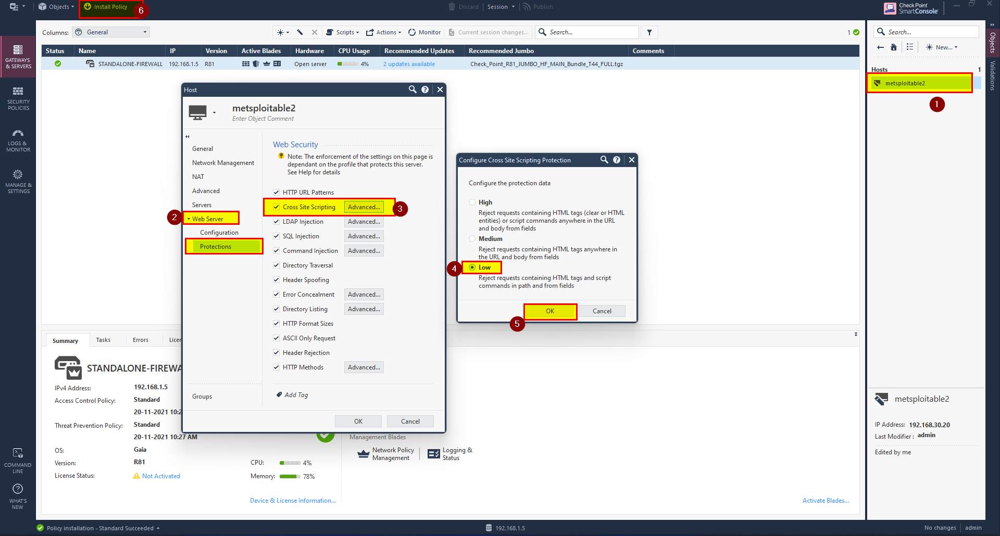

Now we are able to upload any legitimate file and prevent XSS.

Coming to File upload, the file containing php code to give use command injection, to prevent this will block the function system.

To do this follow the steps below:

1- Click on Security Policies then Threat Prevention Policy.

2- In Threat Tools click on IPS Protections.

3- In search bar search for command injection.

4- Right click and click Edit.

5- Right click on Strict profile and select Edit.

6- click on Advance and in Non-distinct Shell Commands click '+'.

7- Add pattern name as "system".

8- Click Ok for all.

9-Install the Policy.

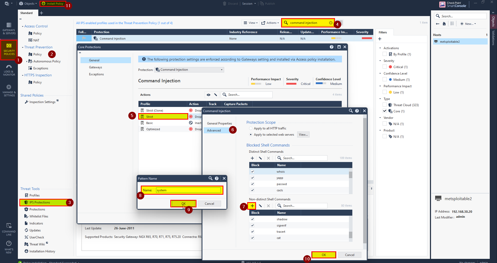

Preform the attack and check wither the IPS prevent the attack or not.

**Attack has been prevented.**

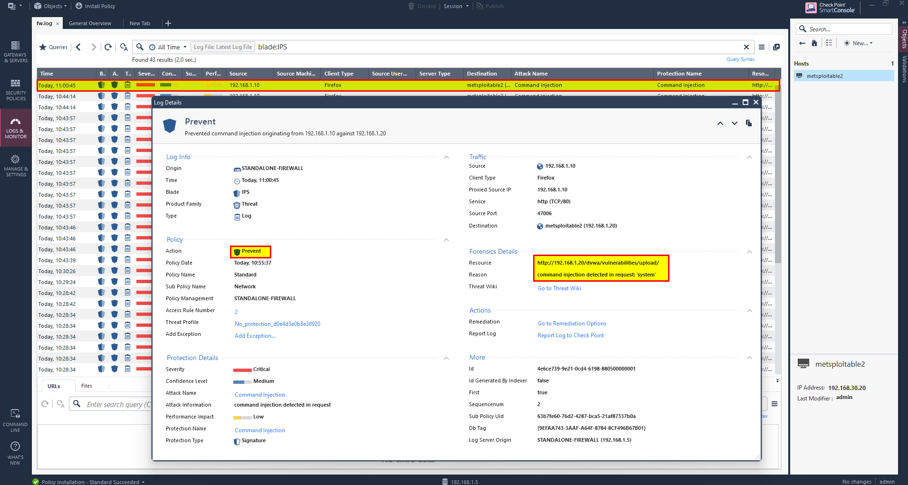

This is one way to prevent such attacks probably there are more ways to prevent it.
The same methodology can be applied to prevent other attacks.
In this article, we have to configure the IPS blade properly and don't rely on the default configuration.

## I hope this is interesting and helpful thanks for reading.